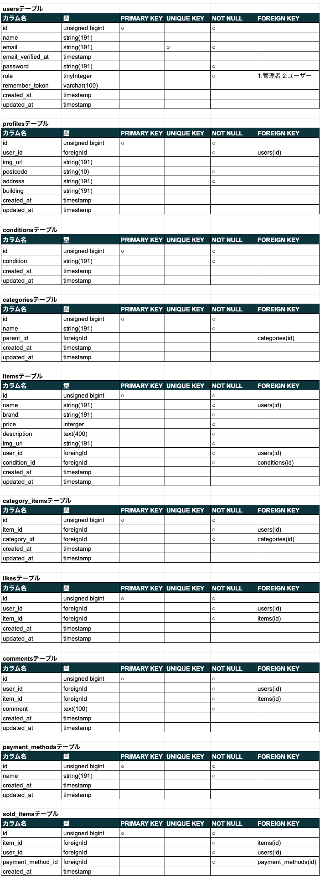
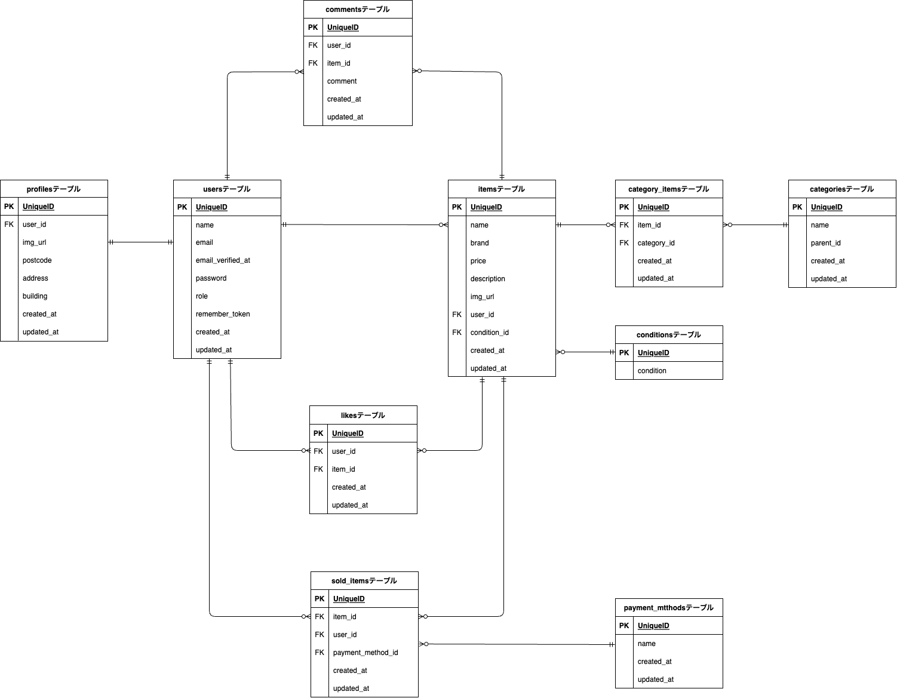

# coachtech-furima（フリマアプリ）

ある企業が開発した独自のフリマアプリ coachtechフリマ です。  
競合他社のサイトは機能や画面が複雑で使いづらいという調査から、シンプルな設計で作成しました。

- トップページ（メインページ）


トップページでは、おすすめとマイリストに分けて、出品された商品の画像を一覧で表示できるようにしています。  
「おすすめ」では、出品された商品を新しい順に並べ、「マイリスト」では、お気に入りに追加した商品の一覧が表示されるようになっています。（マイリストには認証が必要です。）  
ヘッダー部分には検索機能があり、カテゴリ、商品名での検索が可能です。  
また、画面右上には「ログイン」「会員登録」のリンクと「出品ボタン」があり、クリックすると各ページに遷移することが出来ます。

- 商品詳細ページ


商品詳細ページでは、トップページで選択した商品の詳細（画像、商品名、価格、商品の説明、商品の情報など）を見ることができます。  
「購入する」のボタンを押すと、「購入ページ」に遷移します。  


- 購入ページ


購入ページでは、購入情報（商品代金、支払い金額、支払い方法）を表示し、支払い方法と配送先を選択（変更）した上で、「購入する」ボタンを押して商品の購入が確定できるようになっています。  
支払い方法については、「クレジットカード」「コンビニ払い」「銀行振込」の３つの中から選ぶことが可能です。  
購入が完了したら、「購入完了ページ」に遷移します。  

- マイページ


マイページでは、画面上部にプロフィール画像とユーザー名が表示されます。(デフォルトでは、画像の設定がない為、「プロフィールを編集」のボタンを押すと、「プロフィール編集画面」に遷移し、そこで設定ができます。)  

- menu1、menu2(モーダルウィンドウ)


menu1 と menu2 のウィンドウは、各ページの画面左上にあるアイコンをクリックすることで開くことが可能です。  
「会員登録」や「ログイン」がされていない場合には menu2 が表示され、Registration のリンクから「会員登録ページ」へ、Login のリンクから「ログインページ」へ遷移が出来ます。  
また、会員登録後に「ログイン済」の場合には menu1 が表示され、Home のリンクから「飲食店一覧ページ」へ、Logout のリンクからログアウトした上で「ログインページ」へ、Mypage のリンクから、「マイページ」に遷移できるようになっています。

- 会員登録ページ


- ログインページ


- コメントページ


## 作成した目的

coachtechブランドのアイテムを出品することを目的としてに作成。

## アプリケーション URL

- 開発環境：http://localhost/
- phpMyAdmin:：http://localhost:8080/

## 機能一覧

【基本実装】

- 会員登録機能
- ログイン機能
- ログアウト機能
- 商品一覧取得機能
- 商品詳細取得機能
- 商品お気に入り一覧取得機能
- ユーザー情報取得機能
- ユーザー購入商品一覧取得機能
- ユーザー出品商品一覧取得機能
- 飲食店一覧取得機能
- 飲食店詳細取得機能
- プロフィール変更機能
- 商品お気に入り追加機能
- 商品お気に入り削除機能
- 商品コメント追加機能
- 商品コメント削除機能
- キーワード検索機能
- カテゴリ検索機能
- ブランド検索機能

【追加実装】


## 使用技術（実行環境）

- PHP7.4.9
- Laravel8.83.27
- MySQL8.0.26
- Breeze1.10

## テーブル設計



## ER 図



## 環境構築

**Docker ビルド**

1. `git clone git@github.com:kngshi/sim_rese.git(変更前)`
2. DockerDesktop アプリを立ち上げる
3. `docker-compose up -d --build`

> _Mac の M1・M2 チップの PC の場合、`no matching manifest for linux/arm64/v8 in the manifest list entries`のメッセージが表示されビルドができないことがあります。
> エラーが発生する場合は、docker-compose.yml ファイルの「mysql」内に「platform」の項目を追加で記載してください_

```bash
mysql:
    platform: linux/x86_64(この文を追加)
    image: mysql:8.0.26
    environment:
```

**Laravel 環境構築**

1. `docker-compose exec php bash`
2. `composer install`
3. 「.env.example」ファイルを 「.env」ファイルに命名を変更。または、新しく.env ファイルを作成
4. .env に以下の環境変数を追加

```text
DB_CONNECTION=mysql
DB_HOST=mysql
DB_PORT=3306
DB_DATABASE=laravel_db
DB_USERNAME=laravel_user
DB_PASSWORD=laravel_pass
```

5. アプリケーションキーの作成

```bash
php artisan key:generate
```

6. マイグレーションの実行

```bash
php artisan migrate
```

7. シーディングの実行

```bash
php artisan db:seed
```

**Laravel Breeze のインストール**

1. `composer require laravel/breeze --dev`
2. `php artisan breeze:install blade`
3. `php artisan migrate`
4. `npm install`
5. `npm run dev`