# coachtech-furima（フリマアプリ）

ある企業が開発した独自のフリマアプリ「coachtech フリマ」です。  
競合他社のサイトは、機能や画面が複雑で使いづらいという調査から、シンプルな設計で作成しました。

- トップページ（おすすめ商品一覧）

ログイン前  
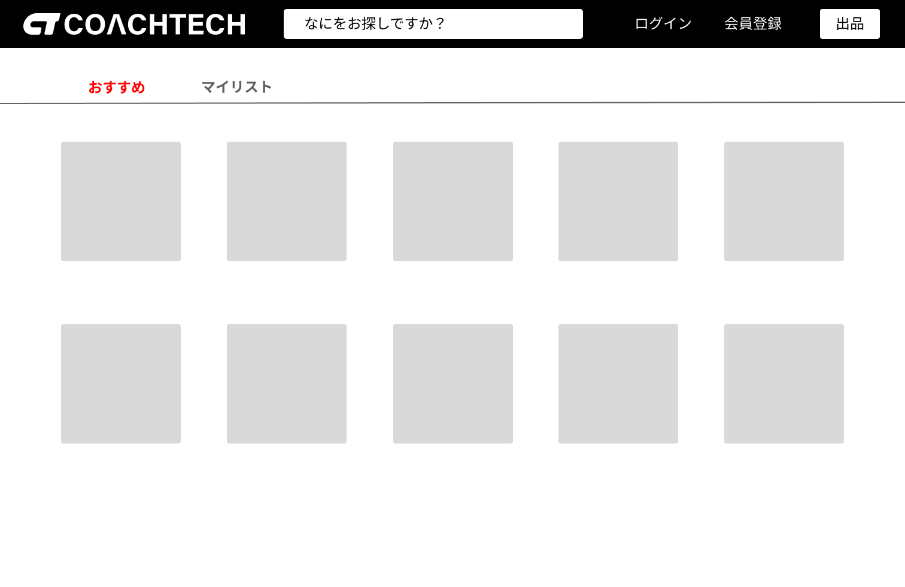

ログイン後  
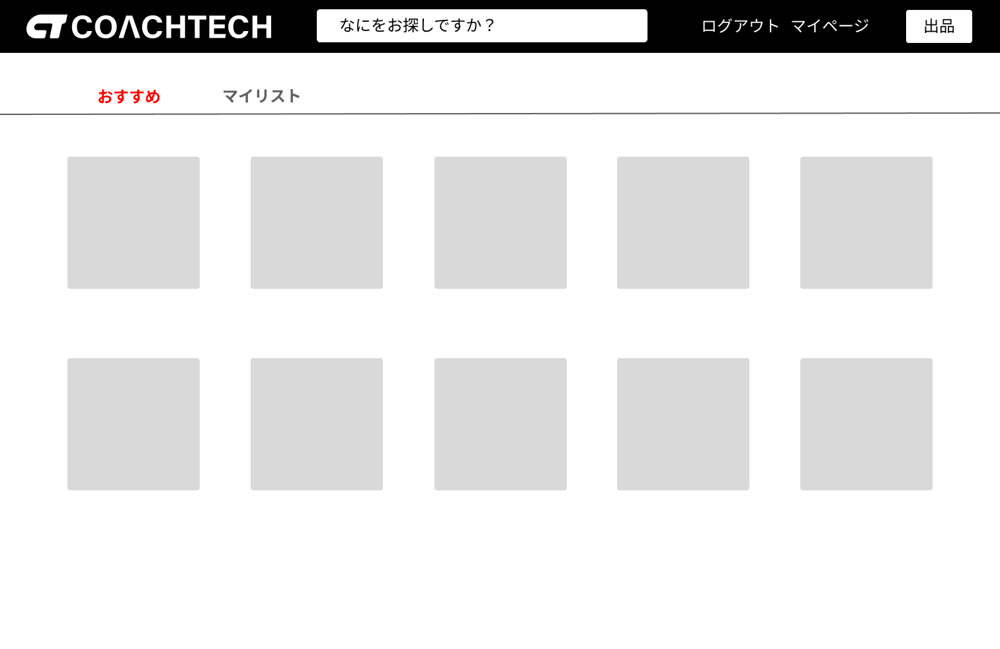

トップページでは、おすすめとマイリストに分けて、商品の画像を一覧で表示できるようにしています。  
おすすめでは出品された商品の一覧が、マイリストではお気に入りに追加した商品の一覧が表示されるようになっています。（マイリストは要認証）  
また、画面右上の「ログイン」「会員登録」リンク、「出品」ボタンからは、各ページに遷移することが出来ます。（ログイン完了後、画面右上のリンクは「ログアウト」「マイページ」に変わります。）  
ヘッダー部分には検索機能があり、商品名、カテゴリ名での検索が可能です。

- 会員登録ページ

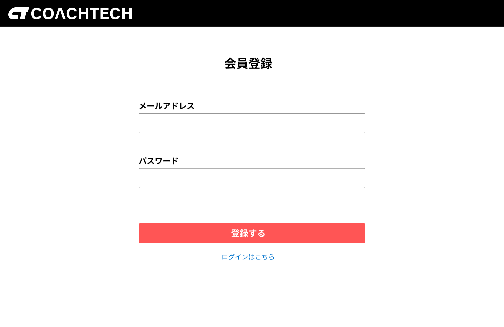

会員登録時には、メールアドレスとパスワードの入力を必須にしています。(氏名の登録は、会員登録完了後、マイページのプロフィール編集画面から行います。)

- ログインページ

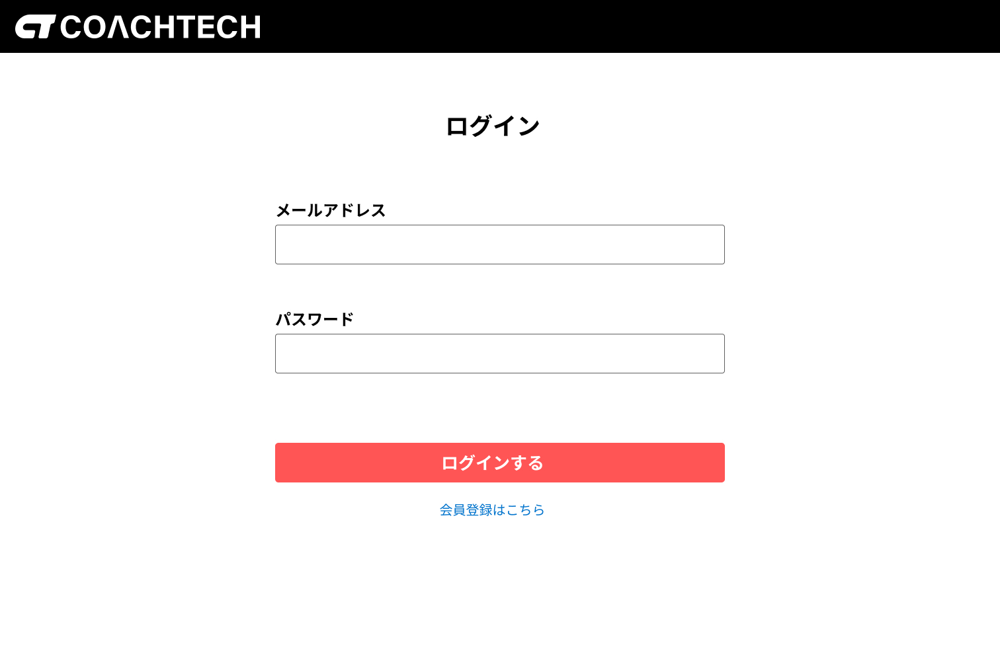

ログインページでは、登録されたメールアドレスとパスワードで本人確認を行い、認証が完了したらログインが出来ます。

- 商品詳細ページ

ログイン前  
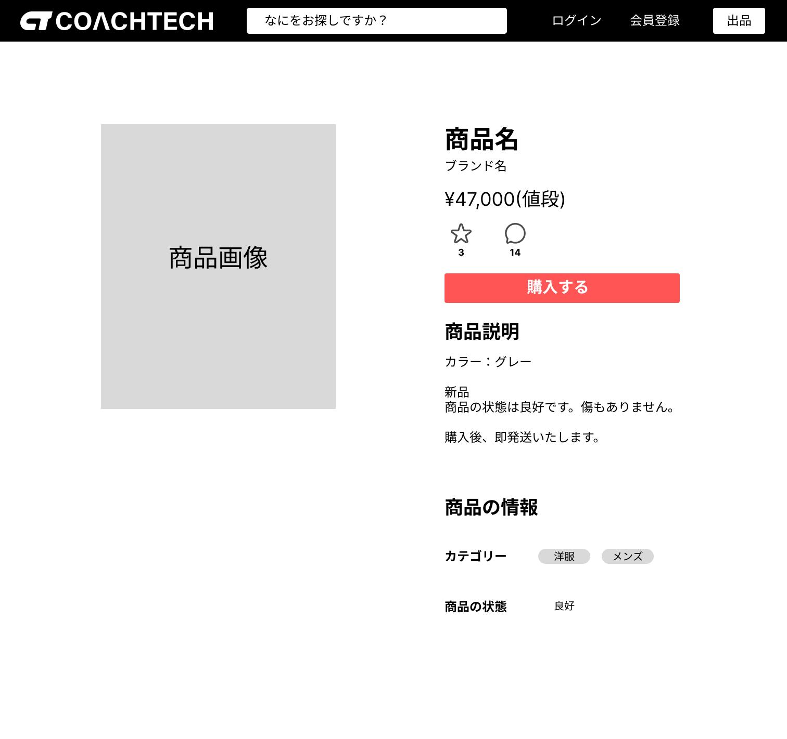

ログイン後  


商品詳細ページでは、トップページで選択した商品の詳細情報を見ることができます。  
星マークのアイコンを押すとお気に入り登録が、吹き出しのアイコンを押すとコメントの書き込みが可能です。  
「購入する」ボタンからは購入ページに遷移します。

- コメントページ

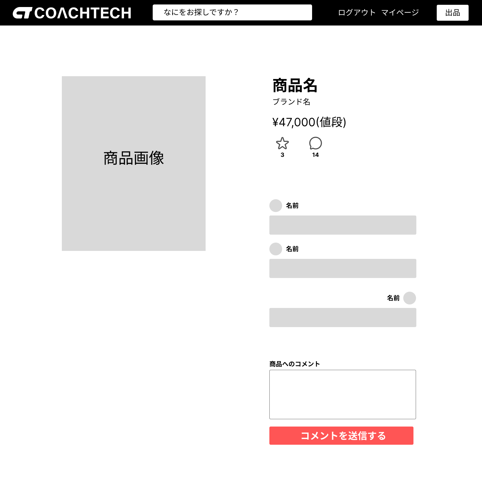

コメントページでは、商品に対するコメントが可能です。(最大 100 字に指定)  
他のユーザーがコメントした内容も見ることが出来、自分が投稿したコメントは削除することが可能です。

- 購入ページ

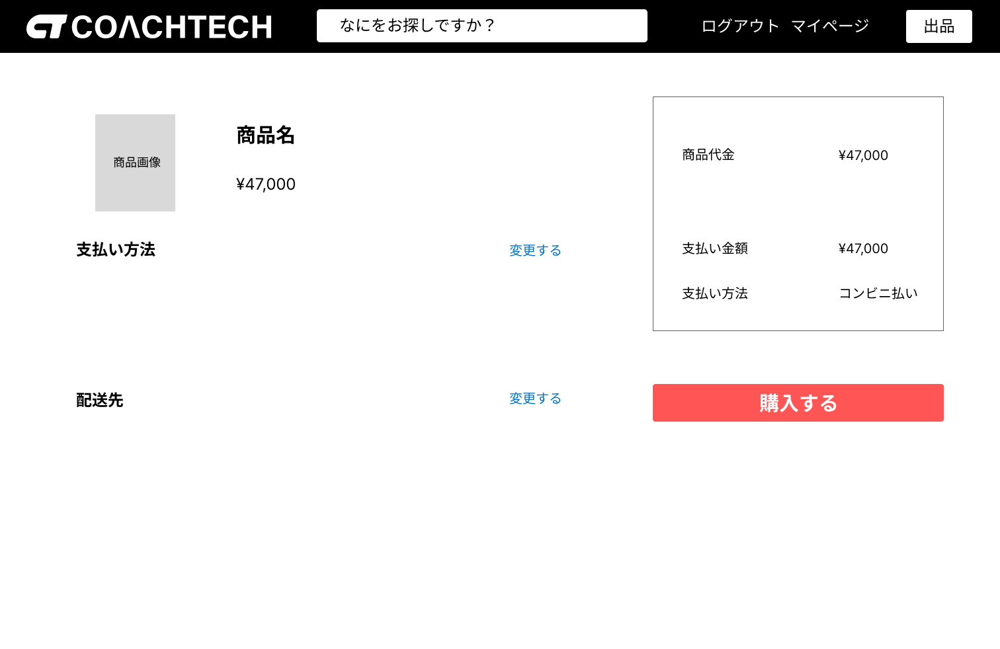

- 住所変更ページ

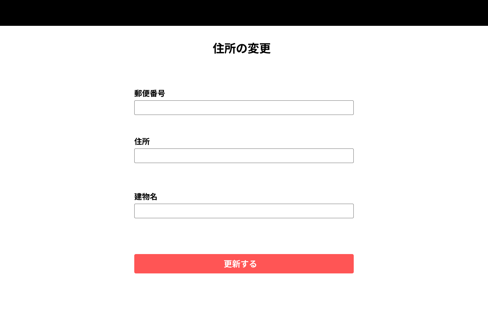

購入ページでは、支払い方法の選択・変更と、配送先の変更が可能です。（それぞれ「変更する」ボタンから各ページに遷移。）  
支払い方法は、「クレジットカード」「コンビニ払い」「銀行振込」の３つの中から選ぶことができます。  
配送先は、マイページから登録済みの場合にはその住所へ、未登録の場合には住所変更ページで入力します。  
「購入する」のボタンを押すと、購入完了ページに遷移します。(クレジットカード決済の場合には、Stripe 決済画面に遷移。)

- マイページ

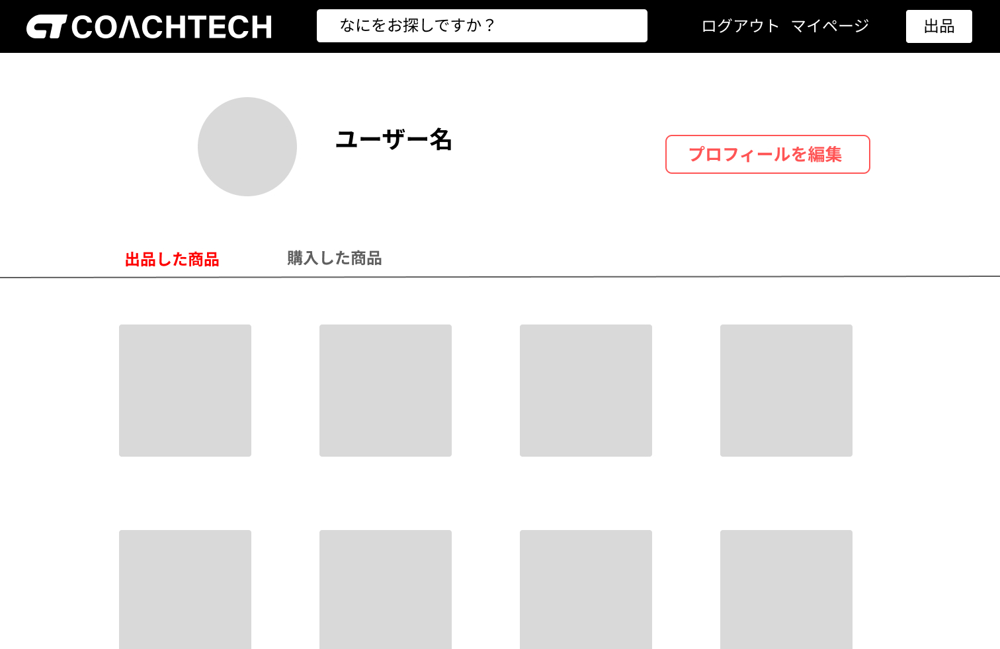

- プロフィール編集ページ

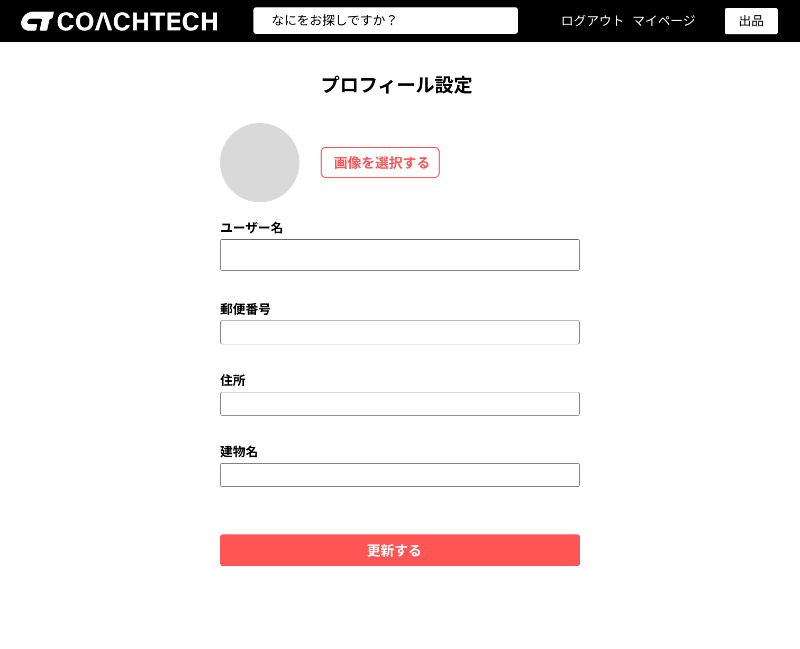

マイページでは、画面上部にユーザー情報が表示され、出品した商品と購入した商品の一覧が表示されるようになっています。  
「プロフィールを編集」のボタンから、プロフィール編集画面へ遷移し、ユーザー情報が登録できるようになっています。(画像のみ任意登録で、入力必須にしていません。)

- 出品ページ

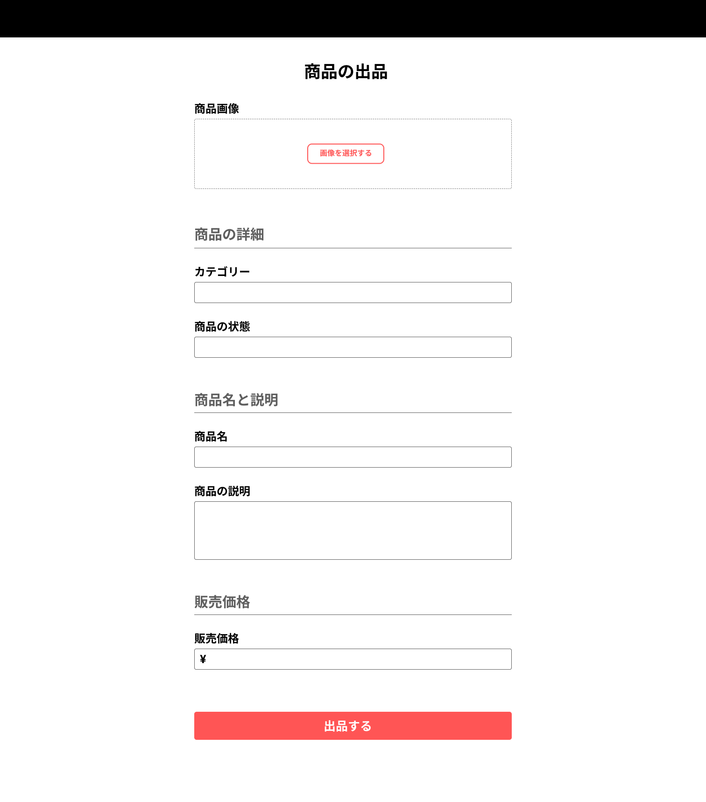

出品ページでは、商品の情報を入力し、「出品する」のボタンから商品を出品することができます。(全項目入力必須)  
カテゴリは、親カテゴリと子カテゴリを１つずつ選択する形︎（例：ファッション>メンズ）になっており、商品の状態については、4 段階(新品・未使用/非常に良好/良好/可)から選択します。

## 作成した目的

coachtech ブランドのアイテムを出品することを目的として作成しました。

## アプリケーション URL

- 開発環境：http://localhost/
- phpMyAdmin:：http://localhost:8080/

## 機能一覧

【基本実装】

- 会員登録機能
- ログイン機能
- ログアウト機能
- 商品一覧取得機能
- 商品詳細取得機能
- 商品お気に入り一覧取得機能
- ユーザー情報取得機能
- ユーザー購入商品一覧取得機能
- ユーザー出品商品一覧取得機能
- 飲食店一覧取得機能
- 飲食店詳細取得機能
- プロフィール変更機能
- 商品お気に入り追加機能
- 商品お気に入り削除機能
- 商品コメント追加機能
- 商品コメント削除機能
- キーワード検索機能
- カテゴリ検索機能

【追加実装】

- 配送先変更機能
- Stripe 決済による商品購入機能
- 支払い方法の選択・変更機能
- 管理画面(ユーザー削除機能、コメント削除機能)
- メール送信機能(管理画面からのお知らせメール)
- 画像のストレージ保存機能︎(AWS の S3 を使用)

## 使用技術（実行環境）

- PHP7.4.9
- Laravel8.83.27
- MySQL8.0.26
- Breeze1.10

## テーブル仕様


## ER 図


## 環境構築

**Docker ビルド**

1. `git clone git@github.com:kngshi/coachtech-furima.git`
2. DockerDesktop アプリを立ち上げる
3. `docker-compose up -d --build`

> _Mac の M1・M2 チップの PC の場合、`no matching manifest for linux/arm64/v8 in the manifest list entries`のメッセージが表示されビルドができないことがあります。
> エラーが発生する場合は、docker-compose.yml ファイルの「mysql」内に「platform」の項目を追加で記載してください_

```bash
mysql:
    platform: linux/x86_64(この文を追加)
    image: mysql:8.0.26
    environment:
```

**Laravel 環境構築**

1. `docker-compose exec php bash`
2. `composer install`
3. 「.env.example」ファイルを 「.env」ファイルに命名を変更。または、新しく.env ファイルを作成
4. .env に以下の環境変数を追加

```text
DB_CONNECTION=mysql
DB_HOST=mysql
DB_PORT=3306
DB_DATABASE=laravel_db
DB_USERNAME=laravel_user
DB_PASSWORD=laravel_pass
```

5. アプリケーションキーの作成

```bash
php artisan key:generate
```

6. マイグレーションの実行

```bash
php artisan migrate
```

7. シーディングの実行

```bash
php artisan db:seed
```

> シーディングの際に、テストユーザーを登録しています。
> 管理者として操作する際には、以下のアカウントを使用して下さい。

```text
name: admin
email: admin@example.com
password: admin1234
```

> 一般ユーザーの場合は、以下の２つのアカウントを使用して下さい。

```text
name: sample_user
email: sample@example.com
password: sample1234
```

```text
name: sample_user2
email: sample2@example.com
password: sample1234
```

**Laravel Breeze のインストール**

1. `composer require laravel/breeze --dev`
2. `php artisan breeze:install blade`
3. `php artisan migrate`
4. `npm install`
5. `npm run dev`

**テスト環境構築**

1. `docker-compose exec mysql bash`
2. テスト用のデータベースを作成

- MySQL コンテナ上で、ルートユーザーとして作成

```text
mysql -u root -p
CREATE DATABASE demo_test;
SHOW DATABASES;
```

3. 「.env.example」ファイルを 「.env.testing」ファイルに命名を変更。または、新しく.env.testing ファイルを作成
4. .env.testing に以下の環境変数を追加

```text
APP_ENV=test
APP_KEY=

DB_CONNECTION=mysql
DB_HOST=mysql
DB_PORT=3306
DB_DATABASE=demo_test
DB_USERNAME=root
DB_PASSWORD=root
```

5. config ファイルの変更
   config/database.php の'mysql'の配列部分をコピーし'mysql_test'を作成後、以下の部分を変更。

```text
'database' => 'demo_test',
'username' => 'root',
'password' => 'root',
```

6. アプリケーションキーの作成

```bash
php artisan key:generate --env=testing
```

7. キャッシュのクリア

```bash
php artisan config:clear
```

8. マイグレーションの実行

```bash
php artisan migrate --env=testing
```

9. phpunit.xml の編集（テスト実行時）

```text
<!-- <server name="DB_CONNECTION" value="sqlite"/> -->
<!-- <server name="DB_DATABASE" value=":memory:"/> -->
```

となっている部分を、以下のように変更して下さい。

```text
<server name="DB_CONNECTION" value="mysql_test"/>
<server name="DB_DATABASE" value="demo_test"/>
```
